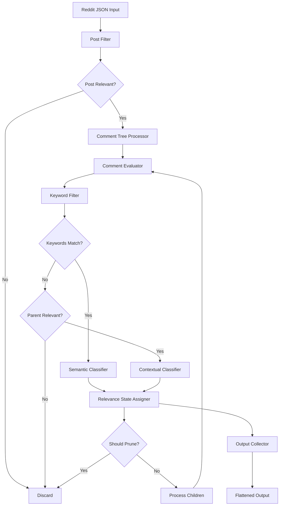

# Design Document: Reddit Relevance Filter

## Overview

The Reddit Relevance Filter is a context-aware filtering module that processes Reddit posts and their nested comment trees to identify content relevant to autonomous, robotic, and AI-assisted surgery research. The system operates as a preprocessing stage before sentiment analysis, using a two-stage filtering approach (keyword + semantic) combined with context inheritance to handle conversational discourse patterns.

### Key Design Principles

1. **Tree-Aware Processing**: Treats Reddit data as hierarchical comment trees where context flows from parent to child
2. **Context Inheritance**: Child comments inherit relevance from parents unless they explicitly diverge
3. **Two-Stage Filtering**: High-recall keyword filtering followed by precision-focused semantic classification
4. **Analytical Content Detection**: Distinguishes substantive discussion from pure jokes/memes using linguistic markers
5. **Subtree Pruning**: Efficiently discards irrelevant branches while allowing recovery of relevant content

### Input/Output

**Input**: Reddit posts with nested comment trees in JSON format
```python
{
  "id": "post_123",
  "subreddit": "medicine",
  "title": "...",
  "selftext": "...",
  "created_utc": 1234567890,
  "score": 42,
  "url": "...",
  "permalink": "...",
  "comments": [
    {
      "id": "comment_456",
      "author": "user1",
      "body": "...",
      "created_utc": 1234567900,
      "score": 10,
      "permalink": "...",
      "replies": [...]
    }
  ]
}
```

**Output**: Flattened list of relevant items
```python
[
  {
    "id": "post_123",
    "type": "post",
    "text": "...",
    "parent_id": None,
    "post_id": "post_123",
    "depth": 0,
    "relevance_score": 0.95,
    "relevance_reason": "keyword+semantic",
    "relevance_state": "RELEVANT_STRONG"
  },
  {
    "id": "comment_456",
    "type": "comment",
    "text": "...",
    "parent_id": "post_123",
    "post_id": "post_123",
    "depth": 1,
    "relevance_score": 0.87,
    "relevance_reason": "inherited",
    "relevance_state": "RELEVANT_INHERITED"
  }
]
```

## Architecture

### Component Overview



### Processing Pipeline

1. **Post-Level Filter**: Evaluate post title + selftext for relevance
2. **Tree Traversal**: Depth-first recursive traversal of comment tree
3. **Comment Evaluation**: For each comment:
   - Apply keyword filter
   - Determine classification mode (local vs contextual)
   - Apply semantic classifier
   - Assign relevance state
   - Decide on subtree pruning
4. **Output Collection**: Collect all relevant items into flattened list

## Components and Interfaces

### 1. RelevanceFilter (Main Orchestrator)

**Responsibility**: Coordinates the entire filtering pipeline

```python
class RelevanceFilter:
    def __init__(self, keyword_filter, semantic_classifier, config):
        self.keyword_filter = keyword_filter
        self.semantic_classifier = semantic_classifier
        self.config = config
        self.output_items = []
    
    def filter_posts(self, posts: List[Dict]) -> List[Dict]:
        """Filter a batch of Reddit posts and their comment trees"""
        pass
    
    def filter_single_post(self, post: Dict) -> Optional[List[Dict]]:
        """Filter a single post and its comment tree"""
        pass
    
    def evaluate_post(self, post: Dict) -> Tuple[bool, float, str]:
        """Evaluate post-level relevance"""
        pass
    
    def process_comment_tree(self, comments: List[Dict], post_id: str, 
                            parent_context: Optional[Dict] = None) -> List[Dict]:
        """Recursively process comment tree with context inheritance"""
        pass
```

### 2. KeywordFilter

**Responsibility**: Stage 1 filtering using high-recall keyword matching

```python
class KeywordFilter:
    def __init__(self):
        self.surgery_keywords = [
            "autonomous surgery", "robotic surgeon", "surgical robot",
            "da vinci", "laparoscopic robot", "surgical automation",
            "ai surgery", "robot-assisted surgery", "robotic surgery"
        ]
        self.procedure_keywords = [
            "cholecystectomy", "prostatectomy", "hysterectomy",
            "cardiac surgery", "minimally invasive"
        ]
        self.context_keywords = [
            "operating room ai", "surgical ai", "autonomous operation",
            "robotic precision", "surgical robotics"
        ]
    
    def matches(self, text: str) -> bool:
        """Check if text contains any relevant keywords"""
        pass
    
    def get_matched_keywords(self, text: str) -> List[str]:
        """Return list of matched keywords for debugging"""
        pass
```

### 3. SemanticClassifier

**Responsibility**: Stage 2 filtering using semantic analysis (embedding or LLM-based)

```python
class SemanticClassifier:
    def __init__(self, model_type: str = "embedding"):
        # model_type: "embedding" or "llm"
        self.model_type = model_type
        if model_type == "embedding":
            self.model = self._load_embedding_model()
            self.reference_embeddings = self._compute_reference_embeddings()
        else:
            self.model = self._load_llm_model()
    
    def classify_local(self, text: str) -> Tuple[str, float]:
        """
        Classify text using only its own content
        Returns: (relevance_state, confidence_score)
        """
        pass
    
    def classify_contextual(self, parent_text: str, child_text: str) -> Tuple[str, float]:
        """
        Classify child text in context of parent
        Returns: (relevance_state, confidence_score)
        """
        pass
    
    def _embedding_classify(self, text: str) -> Tuple[str, float]:
        """Classify using embedding similarity"""
        pass
    
    def _llm_classify(self, text: str, context: Optional[str] = None) -> Tuple[str, float]:
        """Classify using LLM-based binary classification"""
        pass
```

### 4. AnalyticalContentDetector

**Responsibility**: Detect analytical content to inform pruning decisions

```python
class AnalyticalContentDetector:
    def __init__(self):
        self.epistemic_verbs = [
            "think", "believe", "seems", "appears", "would worry",
            "probably", "likely", "suggest", "indicate", "assume"
        ]
        self.causal_markers = [
            "because", "therefore", "so that", "this means",
            "as a result", "consequently", "thus", "hence"
        ]
        self.domain_terms = [
            "error rate", "liability", "training data", "fda",
            "malpractice", "precision", "outcomes", "efficacy",
            "safety", "clinical trial", "patient", "surgeon"
        ]
    
    def has_analytical_content(self, text: str) -> bool:
        """Check if text contains analytical markers"""
        pass
    
    def get_analytical_markers(self, text: str) -> Dict[str, List[str]]:
        """Return matched markers by category for debugging"""
        pass
```

### 5. ConcatenationDecider

**Responsibility**: Determine when to concatenate parent and child text

```python
class ConcatenationDecider:
    def __init__(self, word_threshold: int = 50):
        self.word_threshold = word_threshold
        self.pronouns = ["this", "that", "it", "they", "these", "those"]
        self.evaluative_patterns = [
            r"\b(agree|disagree|correct|wrong|right|exactly|precisely)\b",
            r"\b(good|bad|better|worse|best|worst) (point|idea|argument)\b"
        ]
    
    def should_concatenate(self, parent_context: Dict, child_text: str) -> bool:
        """
        Determine if child should be evaluated with parent context
        
        Conditions:
        1. Parent is RELEVANT_STRONG or RELEVANT_INHERITED
        2. Child uses pronouns
        3. Child is under word_threshold words
        4. Child makes evaluative statements
        5. Child does not introduce new unrelated topic
        """
        pass
    
    def concatenate(self, parent_text: str, child_text: str) -> str:
        """Format concatenated text for classification"""
        return f"PARENT CONTEXT: {parent_text}\nCHILD COMMENT: {child_text}"
```

### 6. CommentEvaluator

**Responsibility**: Evaluate individual comments with full context

```python
class CommentEvaluator:
    def __init__(self, keyword_filter, semantic_classifier, 
                 analytical_detector, concatenation_decider):
        self.keyword_filter = keyword_filter
        self.semantic_classifier = semantic_classifier
        self.analytical_detector = analytical_detector
        self.concatenation_decider = concatenation_decider
    
    def evaluate(self, comment: Dict, parent_context: Optional[Dict], 
                 depth: int) -> Dict:
        """
        Evaluate a single comment and return enriched result
        
        Returns:
        {
            "id": str,
            "type": "comment",
            "text": str,
            "parent_id": str,
            "post_id": str,
            "depth": int,
            "relevance_score": float,
            "relevance_reason": str,
            "relevance_state": str,
            "should_prune": bool,
            "has_analytical_content": bool
        }
        """
        pass
    
    def _determine_classification_mode(self, comment: Dict, 
                                       parent_context: Optional[Dict]) -> str:
        """Determine if we should use local or contextual classification"""
        pass
```

## Data Models

### RelevanceState Enum

```python
from enum import Enum

class RelevanceState(Enum):
    RELEVANT_STRONG = "RELEVANT_STRONG"      # Explicit autonomous surgery content
    RELEVANT_INHERITED = "RELEVANT_INHERITED" # Relevant via parent context
    RELEVANT_WEAK = "RELEVANT_WEAK"          # Tangential but analytical
    IRRELEVANT = "IRRELEVANT"                # Off-topic, joke, meme, drift
```

### ParentContext

```python
@dataclass
class ParentContext:
    """Context passed from parent to child during tree traversal"""
    id: str
    text: str
    relevance_state: RelevanceState
    relevance_score: float
    depth: int
    post_id: str
```

### FilteredItem

```python
@dataclass
class FilteredItem:
    """Output format for filtered content"""
    id: str
    type: str  # "post" or "comment"
    text: str
    parent_id: Optional[str]
    post_id: str
    depth: int
    relevance_score: float
    relevance_reason: str  # "keyword", "semantic", "inherited", "concatenated"
    relevance_state: str   # RelevanceState value
```

### Configuration

```python
@dataclass
class FilterConfig:
    """Configuration for relevance filter"""
    semantic_model_type: str = "embedding"  # "embedding" or "llm"
    embedding_model_name: str = "sentence-transformers/all-MiniLM-L6-v2"
    llm_model_name: Optional[str] = None
    similarity_threshold: float = 0.7
    concatenation_word_threshold: int = 50
    batch_size: int = 32
    enable_pruning: bool = True
    log_level: str = "INFO"
```


## Algorithms and Processing Logic

### Post-Level Filtering Algorithm

```python
def evaluate_post(post: Dict) -> Tuple[bool, float, str]:
    """
    Evaluate post-level relevance
    
    Returns: (is_relevant, confidence_score, reason)
    """
    # Combine title and selftext
    text = f"{post['title']} {post.get('selftext', '')}"
    
    # Stage 1: Keyword filter
    if not keyword_filter.matches(text):
        return (False, 0.0, "no_keywords")
    
    # Stage 2: Semantic classification
    state, score = semantic_classifier.classify_local(text)
    
    if state in [RelevanceState.RELEVANT_STRONG, RelevanceState.RELEVANT_WEAK]:
        return (True, score, "keyword+semantic")
    else:
        return (False, score, "semantic_reject")
```

### Comment Tree Traversal Algorithm

```python
def process_comment_tree(comments: List[Dict], post_id: str, 
                        parent_context: Optional[ParentContext] = None,
                        depth: int = 1) -> List[FilteredItem]:
    """
    Recursively process comment tree with context inheritance
    
    Algorithm:
    1. For each comment at current level:
       a. Evaluate comment with parent context
       b. If relevant, add to output
       c. If should not prune, recursively process replies
    2. Return all relevant items from this subtree
    """
    results = []
    
    for comment in comments:
        # Evaluate current comment
        eval_result = comment_evaluator.evaluate(
            comment, parent_context, depth
        )
        
        # Add to results if relevant
        if eval_result['relevance_state'] != RelevanceState.IRRELEVANT:
            results.append(FilteredItem(
                id=eval_result['id'],
                type='comment',
                text=eval_result['text'],
                parent_id=eval_result['parent_id'],
                post_id=post_id,
                depth=depth,
                relevance_score=eval_result['relevance_score'],
                relevance_reason=eval_result['relevance_reason'],
                relevance_state=eval_result['relevance_state']
            ))
            
            # Create context for children
            child_context = ParentContext(
                id=comment['id'],
                text=comment['body'],
                relevance_state=eval_result['relevance_state'],
                relevance_score=eval_result['relevance_score'],
                depth=depth,
                post_id=post_id
            )
        else:
            child_context = ParentContext(
                id=comment['id'],
                text=comment['body'],
                relevance_state=RelevanceState.IRRELEVANT,
                relevance_score=0.0,
                depth=depth,
                post_id=post_id
            )
        
        # Decide whether to process children
        should_process_children = not eval_result['should_prune']
        
        if should_process_children and 'replies' in comment and comment['replies']:
            # Recursively process replies
            child_results = process_comment_tree(
                comment['replies'],
                post_id,
                child_context,
                depth + 1
            )
            results.extend(child_results)
    
    return results
```

### Comment Evaluation Algorithm

```python
def evaluate_comment(comment: Dict, parent_context: Optional[ParentContext], 
                    depth: int) -> Dict:
    """
    Evaluate a single comment with full context
    
    Decision tree:
    1. If parent is IRRELEVANT:
       - Use local classification on comment text
       - Allow recovery if comment is RELEVANT_STRONG
    
    2. If parent is RELEVANT_STRONG or RELEVANT_INHERITED:
       - Check if should concatenate
       - If concatenate: use contextual classification
       - If not: use local classification
       - Inherit relevance unless clearly off-topic
    
    3. Determine pruning:
       - Prune if IRRELEVANT and no analytical content
       - Don't prune if IRRELEVANT but has analytical content (allow recovery)
       - Don't prune if any level of relevance
    """
    text = comment['body']
    
    # Check for analytical content (used for pruning decision)
    has_analytical = analytical_detector.has_analytical_content(text)
    
    # Determine classification approach
    if parent_context is None or parent_context.relevance_state == RelevanceState.IRRELEVANT:
        # No relevant parent - use local classification
        
        # Stage 1: Keyword filter
        if keyword_filter.matches(text):
            # Stage 2: Semantic classification
            state, score = semantic_classifier.classify_local(text)
            reason = "keyword+semantic" if state != RelevanceState.IRRELEVANT else "semantic_reject"
        else:
            # No keywords and no relevant parent
            state = RelevanceState.IRRELEVANT
            score = 0.0
            reason = "no_keywords"
    
    else:
        # Parent is relevant - consider context inheritance
        
        # Check if we should concatenate
        if concatenation_decider.should_concatenate(parent_context, text):
            # Use contextual classification with concatenated text
            concatenated = concatenation_decider.concatenate(
                parent_context.text, text
            )
            state, score = semantic_classifier.classify_contextual(
                parent_context.text, text
            )
            reason = "concatenated"
        else:
            # Check keywords first
            if keyword_filter.matches(text):
                # Has keywords - use local semantic classification
                state, score = semantic_classifier.classify_local(text)
                reason = "keyword+semantic"
            else:
                # No keywords but parent is relevant
                # Use contextual classification to check for inheritance
                state, score = semantic_classifier.classify_contextual(
                    parent_context.text, text
                )
                
                # If contextual classification says relevant, mark as inherited
                if state in [RelevanceState.RELEVANT_STRONG, RelevanceState.RELEVANT_WEAK]:
                    state = RelevanceState.RELEVANT_INHERITED
                    reason = "inherited"
                else:
                    reason = "context_break"
    
    # Determine pruning decision
    should_prune = (
        state == RelevanceState.IRRELEVANT and 
        not has_analytical
    )
    
    return {
        'id': comment['id'],
        'text': text,
        'parent_id': parent_context.id if parent_context else None,
        'post_id': parent_context.post_id if parent_context else None,
        'depth': depth,
        'relevance_score': score,
        'relevance_reason': reason,
        'relevance_state': state,
        'should_prune': should_prune,
        'has_analytical_content': has_analytical
    }
```

### Concatenation Decision Algorithm

```python
def should_concatenate(parent_context: ParentContext, child_text: str) -> bool:
    """
    Determine if child should be evaluated with parent context
    
    All conditions must be met:
    1. Parent is RELEVANT_STRONG or RELEVANT_INHERITED
    2. Child uses pronouns (this, that, it, they, etc.)
    3. Child is under word_threshold words (default 50)
    4. Child makes evaluative statements
    5. Child does not introduce new unrelated topic
    """
    # Condition 1: Parent relevance
    if parent_context.relevance_state not in [
        RelevanceState.RELEVANT_STRONG,
        RelevanceState.RELEVANT_INHERITED
    ]:
        return False
    
    # Condition 2: Child uses pronouns
    child_lower = child_text.lower()
    has_pronouns = any(pronoun in child_lower for pronoun in self.pronouns)
    if not has_pronouns:
        return False
    
    # Condition 3: Child is short
    word_count = len(child_text.split())
    if word_count >= self.word_threshold:
        return False
    
    # Condition 4: Child makes evaluative statements
    has_evaluative = any(
        re.search(pattern, child_lower) 
        for pattern in self.evaluative_patterns
    )
    if not has_evaluative:
        return False
    
    # Condition 5: Child does not introduce new topic
    # Check for topic-introducing keywords that suggest new subject
    new_topic_indicators = [
        "speaking of", "by the way", "off topic",
        "unrelated", "different topic", "changing subject"
    ]
    introduces_new_topic = any(
        indicator in child_lower 
        for indicator in new_topic_indicators
    )
    if introduces_new_topic:
        return False
    
    return True
```

### Analytical Content Detection Algorithm

```python
def has_analytical_content(text: str) -> bool:
    """
    Check if text contains analytical markers
    
    Returns True if text contains at least one of:
    - Epistemic/evaluative verbs
    - Causal markers
    - Domain-specific medical/AI/ethics terms
    """
    text_lower = text.lower()
    
    # Check epistemic verbs
    for verb in self.epistemic_verbs:
        if re.search(r'\b' + verb + r'\b', text_lower):
            return True
    
    # Check causal markers
    for marker in self.causal_markers:
        if marker in text_lower:
            return True
    
    # Check domain terms
    for term in self.domain_terms:
        if re.search(r'\b' + term + r'\b', text_lower):
            return True
    
    return False
```

### Semantic Classification Algorithms

#### Embedding-Based Classification

```python
def _embedding_classify(text: str) -> Tuple[RelevanceState, float]:
    """
    Classify using embedding similarity
    
    Approach:
    1. Compute embedding for input text
    2. Compare with reference embeddings for autonomous surgery
    3. Use cosine similarity threshold
    """
    # Compute text embedding
    text_embedding = self.model.encode(text)
    
    # Compute similarity with reference embeddings
    similarities = cosine_similarity(
        text_embedding.reshape(1, -1),
        self.reference_embeddings
    )[0]
    
    max_similarity = np.max(similarities)
    
    # Classify based on threshold
    if max_similarity >= 0.8:
        return (RelevanceState.RELEVANT_STRONG, max_similarity)
    elif max_similarity >= 0.6:
        return (RelevanceState.RELEVANT_WEAK, max_similarity)
    else:
        return (RelevanceState.IRRELEVANT, max_similarity)
```

#### LLM-Based Classification

```python
def _llm_classify(text: str, context: Optional[str] = None) -> Tuple[RelevanceState, float]:
    """
    Classify using LLM-based binary classification
    
    Approach:
    1. Construct prompt with classification instructions
    2. Call LLM API
    3. Parse response for relevance judgment
    """
    if context:
        prompt = f"""Evaluate if the following comment continues a discussion about autonomous/robotic surgery.

PARENT CONTEXT: {context}

CHILD COMMENT: {text}

Is the child comment relevant to autonomous/robotic surgery? Consider:
- Does it continue the parent's discussion?
- Does it contain analytical content about surgery, robotics, or AI?
- Or is it a joke, meme, or off-topic tangent?

Respond with: RELEVANT_STRONG, RELEVANT_WEAK, or IRRELEVANT"""
    else:
        prompt = f"""Evaluate if the following text is about autonomous, robotic, or AI-assisted surgery.

TEXT: {text}

Is this text meaningfully discussing autonomous/robotic surgery? Consider:
- Does it discuss surgical robots, AI in surgery, or autonomous surgical systems?
- Does it contain analytical or technical content?
- Or is it just a joke, metaphor, or sci-fi reference?

Respond with: RELEVANT_STRONG, RELEVANT_WEAK, or IRRELEVANT"""
    
    response = self.model.generate(prompt)
    
    # Parse response
    if "RELEVANT_STRONG" in response:
        return (RelevanceState.RELEVANT_STRONG, 0.9)
    elif "RELEVANT_WEAK" in response:
        return (RelevanceState.RELEVANT_WEAK, 0.7)
    else:
        return (RelevanceState.IRRELEVANT, 0.3)
```

## Error Handling

### Input Validation

- **Missing Fields**: Handle posts/comments with missing fields gracefully
  - If `selftext` is missing, use only `title`
  - If `body` is missing, skip comment
  - If `replies` is missing, treat as empty list

### API Failures

- **Semantic Classifier Failures**: 
  - Implement retry logic with exponential backoff
  - Fall back to keyword-only classification if semantic classifier fails
  - Log failures for debugging

### Edge Cases

- **Empty Text**: Treat empty or whitespace-only text as IRRELEVANT
- **Very Long Text**: Truncate text to model's max length (e.g., 512 tokens)
- **Malformed JSON**: Skip malformed posts/comments and log errors
- **Circular References**: Prevent infinite loops in tree traversal (should not occur in Reddit data)

### Logging

```python
import logging

logger = logging.getLogger("relevance_filter")

# Log key decisions
logger.info(f"Post {post_id}: {relevance_state} (score={score:.2f})")
logger.debug(f"Comment {comment_id}: concatenation={should_concat}, analytical={has_analytical}")
logger.warning(f"Semantic classifier failed for {item_id}, falling back to keywords")
logger.error(f"Malformed comment: {comment_id}")
```


## Correctness Properties

*A property is a characteristic or behavior that should hold true across all valid executions of a system—essentially, a formal statement about what the system should do. Properties serve as the bridge between human-readable specifications and machine-verifiable correctness guarantees.*

### Property 1: Post-Level Filtering Completeness

*For any* Reddit post, when the post is evaluated, both the title and selftext fields should be analyzed for relevance determination.

**Validates: Requirements 1.1**

### Property 2: Two-Stage Pipeline Enforcement

*For any* content (post or comment) that contains autonomous surgery keywords, the semantic classifier should be invoked to make the final relevance determination.

**Validates: Requirements 1.2, 2.2**

### Property 3: Irrelevant Post Tree Exclusion

*For any* post marked as IRRELEVANT, the output should contain zero comments from that post's comment tree.

**Validates: Requirements 1.4**

### Property 4: Keyword Filter Case Insensitivity

*For any* text containing autonomous surgery keywords, the keyword filter should match regardless of capitalization (lowercase, uppercase, mixed case).

**Validates: Requirements 9.4**

### Property 5: Keyword Filter Comprehensiveness

*For any* text containing at least one term from the surgery keywords (autonomous surgery, robotic surgeon, surgical robot, da Vinci, etc.), procedure keywords (cholecystectomy, prostatectomy, etc.), or context keywords (operating room AI, surgical AI, etc.), the keyword filter should return a match.

**Validates: Requirements 9.1, 9.2, 9.3**

### Property 6: Classification Mode Selection

*For any* comment, if its parent is RELEVANT_STRONG or RELEVANT_INHERITED, contextual classification should be used; if its parent is IRRELEVANT or absent, local classification should be used.

**Validates: Requirements 3.1, 3.4**

### Property 7: Context Inheritance for Continuations

*For any* comment whose parent is RELEVANT_STRONG or RELEVANT_INHERITED, if contextual classification determines the comment continues the discussion, the comment should be marked as RELEVANT_INHERITED.

**Validates: Requirements 3.2**

### Property 8: Recovery from Irrelevant Parents

*For any* comment whose parent is IRRELEVANT, if local classification finds strong autonomous surgery content in the comment, the comment should be marked as RELEVANT_STRONG.

**Validates: Requirements 3.5**

### Property 9: Concatenation Conditions

*For any* comment, concatenation with parent text should occur if and only if all five conditions are met: (1) parent is RELEVANT_STRONG or RELEVANT_INHERITED, (2) child uses pronouns, (3) child is under 50 words, (4) child makes evaluative statements, (5) child does not introduce new topic.

**Validates: Requirements 4.2, 4.4**

### Property 10: Concatenation Format Consistency

*For any* parent-child pair that meets concatenation conditions, the concatenated text should follow the exact format "PARENT CONTEXT: <parent text>\nCHILD COMMENT: <child text>".

**Validates: Requirements 4.3**

### Property 11: Analytical Content Detection

*For any* text, analytical content should be detected if and only if the text contains at least one epistemic/evaluative verb (think, believe, seems, etc.), causal marker (because, therefore, etc.), or domain-specific term (error rate, liability, FDA, etc.).

**Validates: Requirements 7.2**

### Property 12: Subtree Pruning Rule

*For any* comment marked IRRELEVANT, if the comment lacks analytical content, none of its descendant comments should appear in the output; if the comment contains analytical content, its immediate children should be evaluated (allowing recovery).

**Validates: Requirements 7.1, 7.3, 7.4**

### Property 13: Depth-First Traversal Order

*For any* comment tree, comments should be processed in depth-first order, meaning all descendants of a comment are processed before moving to the next sibling.

**Validates: Requirements 6.1**

### Property 14: Parent-Child Relationship Preservation

*For any* comment in the output, the parent_id field should correctly reference the comment's parent, and the post_id field should correctly reference the top-level post.

**Validates: Requirements 6.4, 8.4**

### Property 15: Depth Tracking Accuracy

*For any* comment in the output, the depth field should equal the number of ancestors between the comment and the root post (post has depth 0, direct replies have depth 1, etc.).

**Validates: Requirements 6.2**

### Property 16: Output Uniqueness of Relevance State

*For any* item in the output, exactly one relevance_state should be assigned from the set {RELEVANT_STRONG, RELEVANT_INHERITED, RELEVANT_WEAK, IRRELEVANT}.

**Validates: Requirements 5.1**

### Property 17: Output Contains Only Relevant Items

*For any* item in the output, the relevance_state should not be IRRELEVANT (only relevant items are included in output).

**Validates: Requirements 8.1**

### Property 18: Output Field Completeness

*For any* item in the output, all required fields should be present: id, type, text, parent_id, post_id, depth, relevance_score, relevance_reason, relevance_state.

**Validates: Requirements 8.2**

### Property 19: Text Preservation

*For any* comment or post in the input, if it appears in the output, its text field should be identical to the original body/title+selftext (no modification).

**Validates: Requirements 8.3**

### Property 20: Batch Processing Independence

*For any* set of posts, the relevance filtering results for each post should be identical regardless of the order in which posts are processed or whether they are processed sequentially or in parallel.

**Validates: Requirements 11.3**

### Property 21: Topic-Based Classification Independence from Sentiment

*For any* two pieces of content with identical topic (both about autonomous surgery) but opposite sentiment (one positive, one negative), both should receive the same relevance classification.

**Validates: Requirements 13.2, 13.4**

### Property 22: Topic-Based Classification Independence from Stance

*For any* two pieces of content with identical topic (both about autonomous surgery) but opposite stance (one supportive, one skeptical), both should receive the same relevance classification.

**Validates: Requirements 13.3, 13.4**


## Testing Strategy

### Dual Testing Approach

The testing strategy employs both unit tests and property-based tests as complementary approaches:

- **Unit tests**: Verify specific examples, edge cases, and error conditions
- **Property tests**: Verify universal properties across all inputs through randomization

Together, these approaches provide comprehensive coverage where unit tests catch concrete bugs and property tests verify general correctness.

### Property-Based Testing

**Framework**: Use `hypothesis` library for Python property-based testing

**Configuration**:
- Minimum 100 iterations per property test (due to randomization)
- Each property test must reference its design document property
- Tag format: `# Feature: reddit-relevance-filter, Property {number}: {property_text}`

**Test Data Generators**:

```python
from hypothesis import given, strategies as st
from hypothesis.strategies import composite

@composite
def reddit_post(draw):
    """Generate random Reddit post"""
    return {
        'id': draw(st.text(min_size=5, max_size=10)),
        'subreddit': draw(st.sampled_from(['medicine', 'technology', 'science'])),
        'title': draw(st.text(min_size=10, max_size=200)),
        'selftext': draw(st.text(min_size=0, max_size=500)),
        'created_utc': draw(st.integers(min_value=1000000000, max_value=2000000000)),
        'score': draw(st.integers(min_value=0, max_value=10000)),
        'url': draw(st.text(min_size=10, max_size=50)),
        'permalink': draw(st.text(min_size=10, max_size=50)),
        'comments': draw(st.lists(reddit_comment(), max_size=5))
    }

@composite
def reddit_comment(draw, max_depth=3):
    """Generate random Reddit comment with nested replies"""
    depth = draw(st.integers(min_value=0, max_value=max_depth))
    return {
        'id': draw(st.text(min_size=5, max_size=10)),
        'author': draw(st.text(min_size=3, max_size=20)),
        'body': draw(st.text(min_size=1, max_size=300)),
        'created_utc': draw(st.integers(min_value=1000000000, max_value=2000000000)),
        'score': draw(st.integers(min_value=-100, max_value=1000)),
        'permalink': draw(st.text(min_size=10, max_size=50)),
        'replies': draw(st.lists(reddit_comment(max_depth=depth-1), max_size=3)) if depth > 0 else []
    }

@composite
def comment_with_keywords(draw):
    """Generate comment containing autonomous surgery keywords"""
    keywords = [
        "autonomous surgery", "robotic surgeon", "surgical robot",
        "da Vinci robot", "robot-assisted surgery"
    ]
    keyword = draw(st.sampled_from(keywords))
    prefix = draw(st.text(min_size=0, max_size=50))
    suffix = draw(st.text(min_size=0, max_size=50))
    return f"{prefix} {keyword} {suffix}"

@composite
def analytical_text(draw):
    """Generate text with analytical content markers"""
    epistemic = ["I think", "It seems", "This suggests", "Probably"]
    causal = ["because", "therefore", "as a result"]
    domain = ["error rate", "patient safety", "FDA approval", "clinical outcomes"]
    
    marker_type = draw(st.sampled_from(['epistemic', 'causal', 'domain']))
    if marker_type == 'epistemic':
        marker = draw(st.sampled_from(epistemic))
    elif marker_type == 'causal':
        marker = draw(st.sampled_from(causal))
    else:
        marker = draw(st.sampled_from(domain))
    
    prefix = draw(st.text(min_size=0, max_size=50))
    suffix = draw(st.text(min_size=0, max_size=50))
    return f"{prefix} {marker} {suffix}"
```

**Example Property Tests**:

```python
# Feature: reddit-relevance-filter, Property 3: Irrelevant Post Tree Exclusion
@given(reddit_post())
def test_irrelevant_post_excludes_all_comments(post):
    """For any post marked IRRELEVANT, output should contain zero comments from that post"""
    filter = RelevanceFilter(keyword_filter, semantic_classifier, config)
    
    # Mock semantic classifier to mark post as irrelevant
    with patch.object(semantic_classifier, 'classify_local', return_value=(RelevanceState.IRRELEVANT, 0.2)):
        results = filter.filter_single_post(post)
    
    # Count comments from this post in output
    comment_count = sum(1 for item in results if item['type'] == 'comment' and item['post_id'] == post['id'])
    
    assert comment_count == 0, f"Expected 0 comments from irrelevant post, got {comment_count}"

# Feature: reddit-relevance-filter, Property 4: Keyword Filter Case Insensitivity
@given(st.sampled_from(['robotic surgery', 'ROBOTIC SURGERY', 'Robotic Surgery', 'RoBoTiC sUrGeRy']))
def test_keyword_filter_case_insensitive(text):
    """For any keyword, filter should match regardless of capitalization"""
    kf = KeywordFilter()
    assert kf.matches(text), f"Keyword filter failed to match: {text}"

# Feature: reddit-relevance-filter, Property 12: Subtree Pruning Rule
@given(reddit_comment())
def test_subtree_pruning_without_analytical_content(comment):
    """For any IRRELEVANT comment without analytical content, descendants should not appear in output"""
    filter = RelevanceFilter(keyword_filter, semantic_classifier, config)
    
    # Ensure comment has no analytical content
    comment['body'] = "lol this is hilarious"
    
    # Mock to mark as irrelevant
    with patch.object(semantic_classifier, 'classify_local', return_value=(RelevanceState.IRRELEVANT, 0.1)):
        # Create a post with this comment
        post = {
            'id': 'test_post',
            'title': 'Test',
            'selftext': 'robotic surgery discussion',
            'comments': [comment]
        }
        
        results = filter.filter_single_post(post)
        
        # Count descendants of the irrelevant comment
        descendant_count = sum(1 for item in results if item.get('parent_id') == comment['id'])
        
        assert descendant_count == 0, f"Expected 0 descendants of pruned comment, got {descendant_count}"

# Feature: reddit-relevance-filter, Property 19: Text Preservation
@given(reddit_post())
def test_text_preservation(post):
    """For any comment in output, text should be identical to input"""
    filter = RelevanceFilter(keyword_filter, semantic_classifier, config)
    
    results = filter.filter_single_post(post)
    
    # Build map of input texts
    input_texts = {}
    input_texts[post['id']] = f"{post['title']} {post.get('selftext', '')}"
    
    def collect_texts(comments):
        for comment in comments:
            input_texts[comment['id']] = comment['body']
            if 'replies' in comment:
                collect_texts(comment['replies'])
    
    collect_texts(post.get('comments', []))
    
    # Check all output texts match input
    for item in results:
        if item['id'] in input_texts:
            assert item['text'] == input_texts[item['id']], \
                f"Text modified for {item['id']}: expected '{input_texts[item['id']]}', got '{item['text']}'"
```

### Unit Testing

**Framework**: Use `pytest` for Python unit testing

**Test Categories**:

1. **Specific Examples**: Test concrete cases with known expected outputs
   - Example: Post about da Vinci robot should be RELEVANT_STRONG
   - Example: Comment "I can finally automate my organ harvesting!" should be IRRELEVANT

2. **Edge Cases**: Test boundary conditions
   - Empty text
   - Very long text (>10,000 characters)
   - Missing fields (no selftext, no replies)
   - Deeply nested comments (depth > 20)

3. **Error Conditions**: Test error handling
   - Malformed JSON
   - API failures in semantic classifier
   - Network timeouts

**Example Unit Tests**:

```python
def test_da_vinci_robot_post_is_relevant():
    """Post explicitly about da Vinci robot should be RELEVANT_STRONG"""
    post = {
        'id': 'test1',
        'title': 'New da Vinci surgical robot capabilities',
        'selftext': 'The latest da Vinci Xi system can perform complex procedures...',
        'comments': []
    }
    
    filter = RelevanceFilter(keyword_filter, semantic_classifier, config)
    results = filter.filter_single_post(post)
    
    assert len(results) == 1
    assert results[0]['relevance_state'] == 'RELEVANT_STRONG'

def test_organ_harvesting_joke_is_irrelevant():
    """Joke about organ harvesting should be IRRELEVANT"""
    post = {
        'id': 'test2',
        'title': 'Robotic surgery discussion',
        'selftext': 'Autonomous robots are improving...',
        'comments': [
            {
                'id': 'comment1',
                'body': 'I can finally automate my organ harvesting operation!',
                'replies': []
            }
        ]
    }
    
    filter = RelevanceFilter(keyword_filter, semantic_classifier, config)
    results = filter.filter_single_post(post)
    
    # Comment should be filtered out
    comment_ids = [r['id'] for r in results if r['type'] == 'comment']
    assert 'comment1' not in comment_ids

def test_empty_text_is_irrelevant():
    """Empty or whitespace-only text should be IRRELEVANT"""
    post = {
        'id': 'test3',
        'title': '',
        'selftext': '   ',
        'comments': []
    }
    
    filter = RelevanceFilter(keyword_filter, semantic_classifier, config)
    results = filter.filter_single_post(post)
    
    assert len(results) == 0

def test_semantic_classifier_failure_fallback():
    """When semantic classifier fails, should fall back to keyword-only"""
    post = {
        'id': 'test4',
        'title': 'Robotic surgery advances',
        'selftext': 'New developments in surgical robotics...',
        'comments': []
    }
    
    filter = RelevanceFilter(keyword_filter, semantic_classifier, config)
    
    # Mock semantic classifier to raise exception
    with patch.object(semantic_classifier, 'classify_local', side_effect=Exception("API Error")):
        results = filter.filter_single_post(post)
        
        # Should still include post based on keywords
        assert len(results) == 1
        assert results[0]['relevance_reason'] == 'keyword_fallback'
```

### Integration Testing

**Test End-to-End Pipeline**:

1. Load real Reddit JSON data
2. Run through complete filtering pipeline
3. Verify output format matches expected schema
4. Verify output can be consumed by sentiment analysis pipeline

```python
def test_integration_with_real_data():
    """Test complete pipeline with real Reddit data"""
    # Load real data
    with open('reddit_robotic_surgery_sentiment.json', 'r') as f:
        posts = json.load(f)
    
    # Run filter
    filter = RelevanceFilter(keyword_filter, semantic_classifier, config)
    results = filter.filter_posts(posts)
    
    # Verify output format
    for item in results:
        assert 'id' in item
        assert 'type' in item
        assert item['type'] in ['post', 'comment']
        assert 'text' in item
        assert 'relevance_state' in item
        assert item['relevance_state'] in ['RELEVANT_STRONG', 'RELEVANT_INHERITED', 'RELEVANT_WEAK']
    
    # Verify can be consumed by sentiment pipeline
    # (This would call the actual sentiment analysis code)
    sentiment_results = run_sentiment_analysis(results)
    assert len(sentiment_results) == len(results)

def test_batch_processing_consistency():
    """Test that batch processing produces same results as sequential"""
    posts = load_test_posts(count=10)
    
    filter = RelevanceFilter(keyword_filter, semantic_classifier, config)
    
    # Process sequentially
    sequential_results = []
    for post in posts:
        sequential_results.extend(filter.filter_single_post(post))
    
    # Process as batch
    batch_results = filter.filter_posts(posts)
    
    # Results should be identical (order may differ)
    assert len(sequential_results) == len(batch_results)
    
    sequential_ids = sorted([r['id'] for r in sequential_results])
    batch_ids = sorted([r['id'] for r in batch_results])
    assert sequential_ids == batch_ids
```

### Performance Testing

**Benchmarks**:

- Process 1000 posts with 10,000 total comments in < 5 minutes
- Memory usage should not exceed 2GB for large datasets
- Semantic classifier should be called efficiently (batched when possible)

```python
def test_performance_large_dataset():
    """Test performance with large dataset"""
    import time
    
    # Generate large dataset
    posts = [generate_test_post() for _ in range(1000)]
    
    filter = RelevanceFilter(keyword_filter, semantic_classifier, config)
    
    start_time = time.time()
    results = filter.filter_posts(posts)
    end_time = time.time()
    
    elapsed = end_time - start_time
    
    assert elapsed < 300, f"Processing took {elapsed:.2f}s, expected < 300s"
    assert len(results) > 0, "Should produce some results"
```

### Test Coverage Goals

- **Line Coverage**: > 90%
- **Branch Coverage**: > 85%
- **Property Test Coverage**: All 22 correctness properties implemented
- **Unit Test Coverage**: All edge cases and error conditions covered

